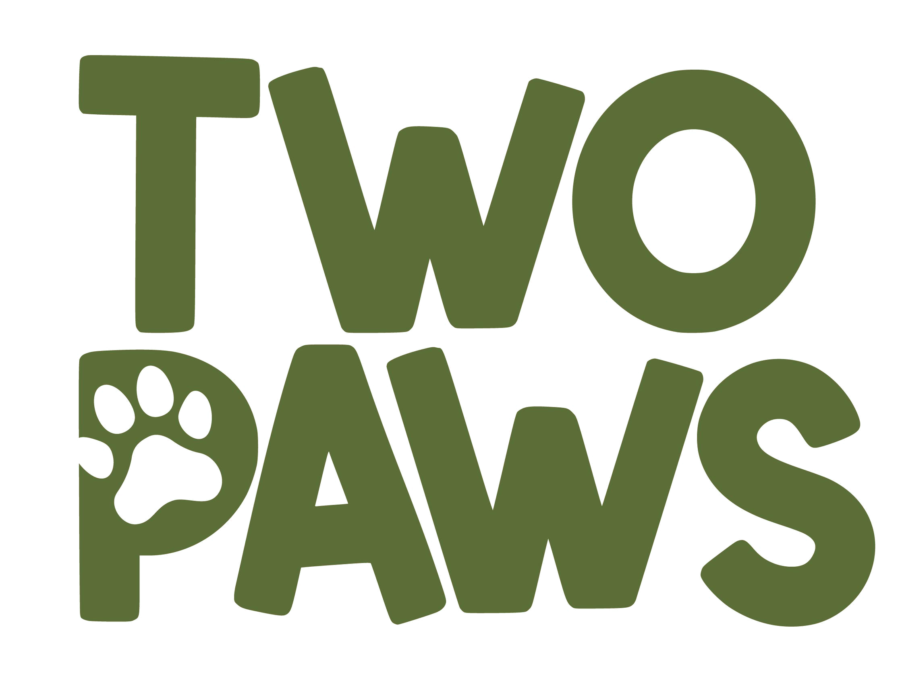

# TwoPaws Pet App Landing Page

A modern, responsive marketing landing page for TwoPaws - the comprehensive mobile app for pet lovers in Egypt.



## 🐾 About TwoPaws

TwoPaws is your pet's best friend in Egypt, connecting pet families with the care and community they deserve. From bustling Cairo to beautiful Alexandria, we're building the ultimate platform for pet owners across Egypt.

## ✨ Key Features

### 🔄 LoopDrop Auto-Delivery
Never run out of pet essentials! Set up automatic delivery schedules for food, treats, and supplies with smart recommendations based on your pet's needs.

### 💕 Pet Match Swiper
Find the perfect playmate or breeding partner for your pet! Swipe through profiles just like dating apps, but for your furry friends to find their soulmates.

### 🏥 Find Trusted Vets
Book appointments with verified veterinarians near you. Read reviews, compare prices, and ensure your pet gets the best care in Egypt.

### 📱 Health & Vaccination Tracker
Keep digital records of your pet's health history and get timely reminders for checkups and vaccinations.

### 🗺️ Pet-Friendly Places
Discover parks, cafés, hotels, and restaurants that welcome your furry friends across Egypt.

### 👥 Pet Owner Community
Connect with fellow pet lovers, share tips, arrange playdates, and get advice from experienced pet owners.

### 🛒 Pet Supplies Marketplace
Shop for premium pet food, toys, accessories, and more with fast delivery across Egypt.

### 🚨 Emergency Care
Quick access to emergency vet services and 24/7 pet helpline when your pet needs it most.

## 🛠️ Tech Stack

- **Frontend:** React 18 with TypeScript
- **Styling:** Tailwind CSS with shadcn/ui components
- **Backend:** Node.js with Express.js
- **Database:** PostgreSQL with Drizzle ORM
- **Build Tool:** Vite
- **Routing:** Wouter
- **Forms:** React Hook Form with Zod validation
- **Animations:** Framer Motion

## 🎨 Design

The landing page features:
- Custom TwoPaws branding with earth-tone colors (cream #FFF7E1, dark green #5C7039, olive #928946)
- Responsive design optimized for all devices
- Smooth animations and interactive elements
- Professional pet-friendly aesthetic

## 🚀 Getting Started

1. Clone the repository:
```bash
git clone https://github.com/hassanredaa/twopaws-landing-page.git
cd twopaws-landing-page
```

2. Install dependencies:
```bash
npm install
```

3. Start the development server:
```bash
npm run dev
```

4. Open your browser and visit `http://localhost:5000`

## 📱 Features Showcase

- **Waitlist Signup:** Collect emails from interested users
- **Newsletter Subscription:** Keep users engaged with updates
- **App Store Badges:** Direct links to iOS and Android downloads
- **Testimonials:** Real user feedback from Egyptian pet owners
- **FAQ Section:** Address common questions
- **Social Media Integration:** Connect across platforms

## 🌟 Screenshots

The landing page includes:
- Hero section with app mockups
- Feature highlights for LoopDrop and Pet Match Swiper
- Customer testimonials
- Frequently asked questions
- Call-to-action sections

## 🤝 Contributing

We welcome contributions to improve the TwoPaws landing page! Please feel free to submit issues and pull requests.

## 📄 License

This project is licensed under the MIT License.

## 📞 Contact

For questions about TwoPaws, please visit our website or contact our support team.

---

Built with ❤️ for pet lovers in Egypt 🇪🇬